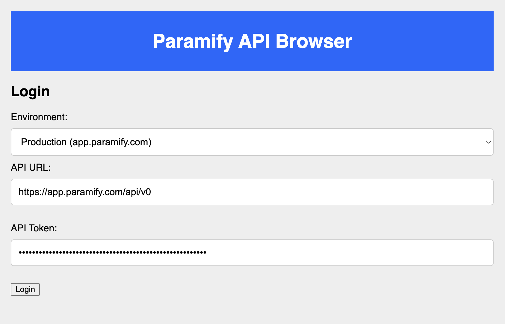
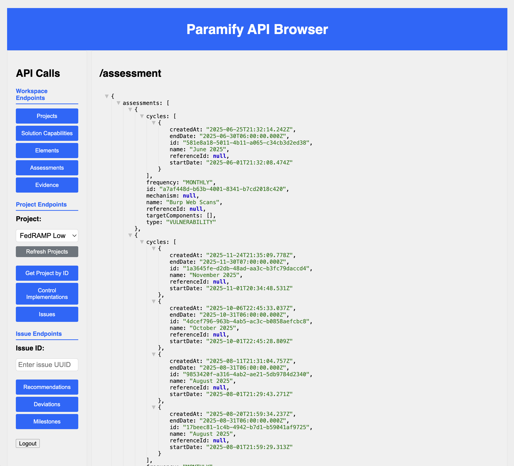

# Paramify API Browser

[](https://dependabot.com)

A simple python application that queries the Paramify REST API and returns the results in an HTML web application. The goal is to provide a jump start to using the Paramify API to understand the available endpoints, data structure and create lightweight console or data access tools.


## Setup Instructions

0. This assumes you have Python installed on your local machine.

1. Clone the repository:
   
   ```bash
   git clone https://github.com/paramify/paramify-api-browser.git
   cd paramify-api-browser
   ```

2. Install the required libraries:
   
   ```
   pip3 install -r requirements.txt
   ```
   
   This installs Flask, Flask-Session, and requests.

3. Start the server:
   
   ```
   python3 server.py
   ```

4. Open a browser to http://localhost:3000

5. Login with your Paramify API credentials:
   - Select your environment from the dropdown (Production, Demo, or Stage)
   - Enter your Bearer token

6. Click the buttons to call the APIs.

## API Authentication

The Paramify REST API uses Bearer token authentication. You'll need:
- **Environment**: Select from Production (app.paramify.com), Demo (demo.paramify.com), or Stage (stage.paramify.com)
- **API Token**: Your Bearer token for authentication

The base API URL will automatically be set based on your environment selection. You can also manually edit the URL if needed.

To create a Paramify API Key, see the [Create a Paramify API Key](https://support.paramify.com/hc/en-us/articles/43292803890451-Create-a-Paramify-API-Key) guide.


## Images

### Login Screen



### API Calls

 


## API Documentation

The full Paramify REST API documentation is available at: https://app.paramify.com/api/documentation/#/


## Acknowledgments

This API Browser example was inspired by and adapted from the [SentinelOne API Browser](https://github.com/Sentinel-One/s1-integration-examples/tree/master/api-browser). We're grateful to SentinelOne, our partner and friends, for their example and open-source contribution.
